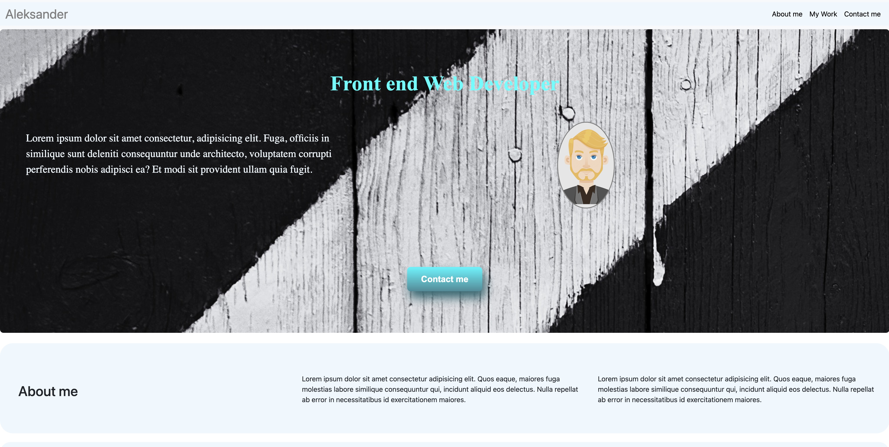

## Suggestions for a good README
Every project is different, so consider which of these sections apply to yours. The sections used in the template are suggestions for most open source projects. Also keep in mind that while a README can be too long and detailed, too long is better than too short. If you think your README is too long, consider utilizing another form of documentation rather than cutting out information.

# Name

Bootstrap Portolio template AI.

## Description

Hi there,
welcome to my repository, this project was written using CSS HTML and Bootstrap.
In this project i have  recreated the project i made before(aleks-ianu.github.io/AI-Portfolio/) made using pure CSS and i adapted it using Bootstrap.
Link to live webpage of project :
https://aleks-ianu.github.io/Bootstrap-Portfolio/

## Visuals

## Project status

This is a working progress project i will be updating as i learn new skills and grow in my journey to become a web developer.
